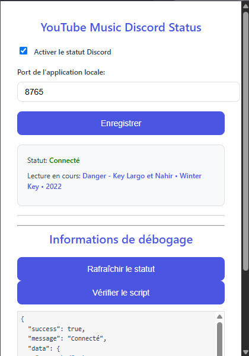
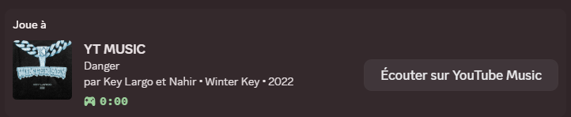

# Discord Status pour YouTube Music

Cette extension Chrome affiche votre lecture YouTube Music en temps réel sur votre statut Discord.

## Fonctionnalités

- Affichage du titre et de l'artiste de la chanson en cours
- Image de couverture de la musique
- Temps de lecture en direct
- Bouton pour écouter la musique sur YouTube Music
- Mise à jour automatique du statut
- Interface de configuration intuitive

## Installation

1. Clonez ce dépôt sur votre machine
2. Ouvrez Chrome et allez dans `chrome://extensions`
3. Activez le mode développeur
4. Cliquez sur "Charger l'extension non empaquetée"
5. Sélectionnez le dossier `chrome-extension`

## Configuration

1. Ouvrez l'extension en cliquant sur l'icône dans la barre d'outils Chrome
2. Activez le statut Discord
3. (Optionnel) Modifiez le port de l'application locale si nécessaire
4. Cliquez sur "Enregistrer"

## Prérequis

- Node.js (pour le serveur local)
- Google Chrome
- Discord
- Un compte YouTube Music

## Aperçu





## Structure du projet

```
YT MUSIC STATUS/
├── chrome-extension/          # Extension Chrome
│   ├── background.js         # Gestionnaire de fond
│   ├── content.js            # Script de contenu
│   ├── popup.html            # Interface utilisateur
│   ├── popup.css             # Styles CSS
│   └── popup.js              # Script de l'interface
├── node-app/                 # Serveur Node.js
│   └── index.js              # Gestionnaire Discord RPC
└── README.md                 # Documentation
```

## Développement

1. Installez les dépendances Node.js :
```bash
npm install discord-rpc express cors
```

2. Lancez le serveur Node.js :
```bash
node node-app/index.js
```

3. Chargez l'extension Chrome comme décrit ci-dessus

## Support

Si vous rencontrez des problèmes, n'hésitez pas à ouvrir une issue sur le dépôt.

## Licence

Ce projet est sous licence MIT - voir le fichier LICENSE pour plus de détails.
